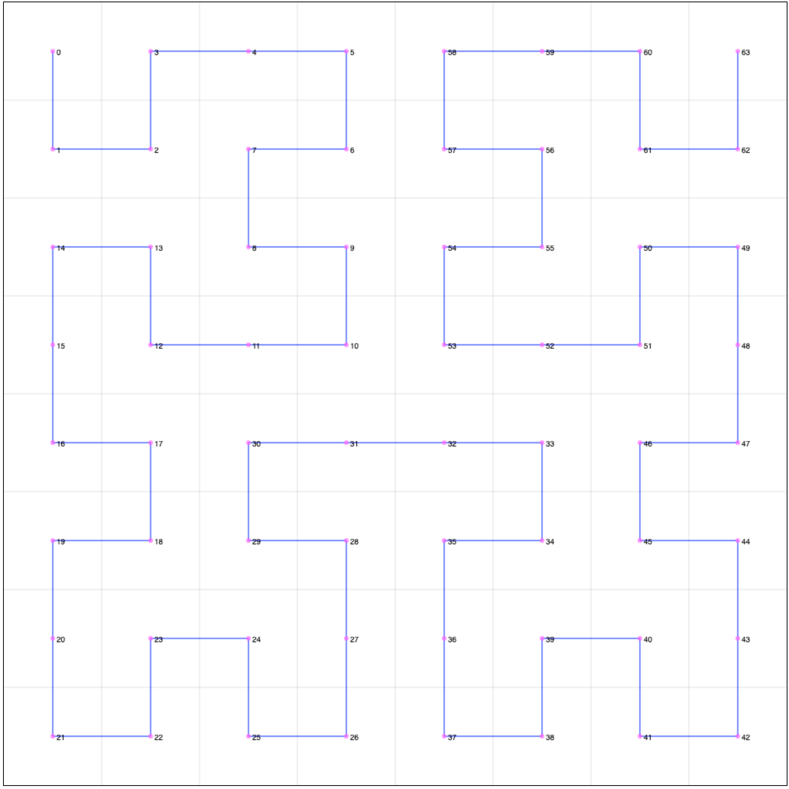

[](https://github.com/MrDesjardins/hilbert-curve-ts/actions/workflows/action.yml)
[](https://codecov.io/gh/MrDesjardins/hilbert-curve-ts)


# Goal

You can use this library to translate a one-dimensional array into a two-dimensional one. The values are projected in similar proximity than in the former original array. Also, the library allows projecting from a two-dimensional array to a single array. Hence, possible to go both ways in a deterministic way.

# How to use?

Download the library:

```
npm install --save hilbert-curve-ts
```

Import:

```
import { HilbertAlgorithm } from "hilbert-curve-ts";
```

Instanciate the class:

```
const h = new HilbertAlgorithm(order);
```

# Hilbert Curve Algorithm

This library is a port of the [Hilbert Curve algorithm from Wikipedia](https://en.wikipedia.org/wiki/Hilbert_curve).

> The library is not a drawing library. Hence if you want to generate a visual for the value, you will need to take the algorithm's output and use another drawing library.

# Extra Features

The library has two functions that allow to offset the coordinate and bring it back to its original values. The offset feature allows bringing the coordinate to a bigger scale. For example, to draw a 4x4 grid (Hilbert Curve of order 2) to a 1024x1024 canvas pixel size.

# How to use?

## Constructor

Call the constructor and specify the order. The order is strongly typed allowing specific order from 1 to 16.

```
const h = new HilbertAlgorithm(2);
```

## 1d to 2d

The function `indexToPoint` brings an index to a specific coordinate. The goal is not to set a value to the coordinate but to compute where a specific index is located in a 2d space. To set a value, for example, a color or a number, you would read the value from your array at that index and set the value to the computed coordinate.

```
const h = new HilbertAlgorithm(2);
const point = ha.indexToPoint(1); //x = 0, y = 1
```

In the code above, if you have an array of `["Test"1, "Test2"]` then you would put the `Test2` string at the coordinate `(0,1)`.

## 2d to 1d

The function `pointToIndex` is the reverse of `indexToPoint`. It takes a point and return the position in 1d.

```
const h = new HilbertAlgorithm(2);
const index = ha.pointToIndex({ x: 0, y: 1 }); // 1
```

The function can be useful if you need to map something in a 2d space (latitude, longitude) into a single space (1d array).

## Offset

The result of `indexToPoint` is a grid of coordinate that are all close to each other. For example `const h = new HilbertAlgorithm(2);` produce an array of 4 by 4 :

```
[
  {x:0, y:0},
  {x:0, y:1},
  {x:0, y:2},
  {x:0, y:3},
  {x:1, y:0},
  {x:1, y:1},
  {x:1, y:2},
  {x:1, y:3},
  {x:2, y:0},
  {x:2, y:1},
  {x:2, y:2},
  {x:2, y:3},
  {x:3, y:0},
  {x:3, y:1},
  {x:3, y:2},
  {x:3, y:3}
]
```

In your application, you might want to distance the point to draw into a canvas and have each cell 10 pixels wide and high. Thus, it is possible to call `offsetPoint` on a point to get the data projected properly. The parameter of `offsetPoint` is the expected grid width (and height) because it is a square. Hence, called `offsetPoint({x:3, y:3}, 40)` gives `{x: 35, y: 35}`. The reason is that we have 4 cells by 4 cells with a width of 40 hence each cell being 10x10 pixel. The coordinate produced is the center of the cell. Since the `(3,3)` points if the last cell it means it spans from 30 to 40 in each direction with a center point at `35,35`.

The opposite is possible as well using `deoffsetPoint`. `deoffsetPoint` takes a point, for example `{x:35, y:35}` and gives back the point `{x:3, y:3}`.

# Examples

You can find in this [interactive CodeSandbox](https://codesandbox.io/s/hilbert-curve-ts-example1-bkwxc?file=/src/HilbertCanvas.tsx) and example that uses all the functions of this library. Open the console of the sandbox to see data.



When the user mouse over the grid, the console writes the value (index) and the coordinate. This is possible using the offset functions.


# Performance

Every build published has a benchmark for many different curve [available here](https://mrdesjardins.github.io/hilbert-curve-ts/dev/bench/).